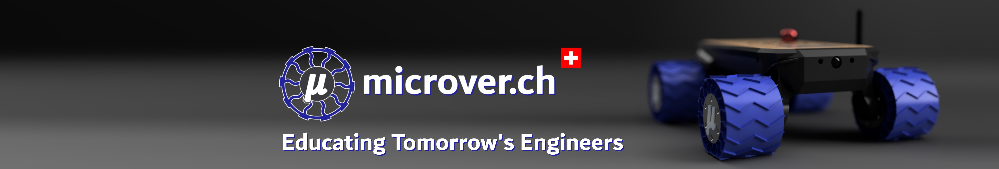

Discover the power of **microver.ch EduBasics** — our flagship product for Education [Learn more](https://www.docs.microver.ch) 📑

## 🚀 About Us

Founded in 2024, **microver.ch** is a leading provider of robotics educational material.

## 🛡️ Main Product: EduBasics Kit

**EduBasics** is a kit of parts for 3 students to assemble into a remote controller rover over the entire schoolyear. 

- **Simplicity**: Consistent usage of the most straight forward components to encourage learning.
- **Accessibility**: Selecting the most well documented and globally recognized ecosystems.
- **Creativity**: Designed to be built into anything in the student's imagination.

For more information, visit the [EduBasics GitHub repository](https://github.com/microver-ch/edubasics).

## 🗨️ Contacts

For more details about our products, services, or any general information regarding microver.ch's Educational Kits, feel free to reach out to us. 

- **Email**: Send us your inquiries or info requests at [contact@microver.ch](mailto:contact@microver.ch).
- **Website**: Visit the official microver.ch page for more information at [www.microver.ch](https://www.microver.ch).

Subscribe to our LinkedIn and Twitter:

[![LinkedIn](https://img.shields.io/badge/subscribe-white.svg?logo=data:image/svg%2bxml;base64,PHN2ZyB2aWV3Qm94PSIwIDAgMjQgMjQiIHhtbG5zPSJodHRwOi8vd3d3LnczLm9yZy8yMDAwL3N2ZyI+PHBhdGggZD0iTTIwLjQ0NyAyMC40NTJoLTMuNTU0di01LjU2OWMwLTEuMzI4LS4wMjctMy4wMzctMS44NTItMy4wMzctMS44NTMgMC0yLjEzNiAxLjQ0NS0yLjEzNiAyLjkzOXY1LjY2N0g5LjM1MVY5aDMuNDE0djEuNTYxaC4wNDZjLjQ3Ny0uOSAxLjYzNy0xLjg1IDMuMzctMS44NSAzLjYwMSAwIDQuMjY3IDIuMzcgNC4yNjcgNS40NTV2Ni4yODZ6TTUuMzM3IDcuNDMzYTIuMDYyIDIuMDYyIDAgMCAxLTIuMDYzLTIuMDY1IDIuMDY0IDIuMDY0IDAgMSAxIDIuMDYzIDIuMDY1em0xLjc4MiAxMy4wMTlIMy41NTVWOWgzLjU2NHYxMS40NTJ6TTIyLjIyNSAwSDEuNzcxQy43OTIgMCAwIC43NzQgMCAxLjcyOXYyMC41NDJDMCAyMy4yMjcuNzkyIDI0IDEuNzcxIDI0aDIwLjQ1MUMyMy4yIDI0IDI0IDIzLjIyNyAyNCAyMi4yNzFWMS43MjlDMjQgLjc3NCAyMy4yIDAgMjIuMjIyIDBoLjAwM3oiIGZpbGw9IiMwQTY2QzIiLz48cGF0aCBzdHlsZT0iZmlsbDojZmZmO3N0cm9rZS13aWR0aDouMDIwOTI0MSIgZD0iTTQuOTE3IDcuMzc3YTIuMDUyIDIuMDUyIDAgMCAxLS4yNC0zLjk0OWMxLjEyNS0uMzg0IDIuMzM5LjI3NCAyLjY1IDEuNDM3LjA2OC4yNS4wNjguNzY3LjAwMSAxLjAxYTIuMDg5IDIuMDg5IDAgMCAxLTEuNjIgMS41MSAyLjMzNCAyLjMzNCAwIDAgMS0uNzktLjAwOHoiLz48cGF0aCBzdHlsZT0iZmlsbDojZmZmO3N0cm9rZS13aWR0aDouMDIwOTI0MSIgZD0iTTQuOTE3IDcuMzc3YTIuMDU2IDIuMDU2IDAgMCAxLTEuNTItMi42NyAyLjA0NyAyLjA0NyAwIDAgMSAzLjQxOS0uNzU2Yy4yNC4yNTQuNDIuNTczLjUxMi45MDguMDY1LjI0LjA2NS43OCAwIDEuMDItLjA1MS4xODYtLjE5Ny41MDQtLjMuNjUyLS4wOS4xMzItLjMxLjM2Mi0uNDQzLjQ2NC0uNDYzLjM1Ny0xLjEuNTAzLTEuNjY4LjM4MlpNMy41NTcgMTQuNzJWOS4wMDhoMy41NTd2MTEuNDI0SDMuNTU3Wk05LjM1MyAxNC43MlY5LjAwOGgzLjQxMXYuNzg1YzAgLjYxNC4wMDUuNzg0LjAyNi43ODMuMDE0IDAgLjA3LS4wNzMuMTI0LS4xNjIuNTI0LS44NjUgMS41MDgtMS40NzggMi42NS0xLjY1LjI3NS0uMDQyIDEtLjA0NyAxLjMzMi0uMDA5Ljc5LjA5IDEuNDUxLjMxNiAxLjk0LjY2NC4yMi4xNTcuNTU3LjQ5My43MTQuNzEzLjQyLjU5Mi42OSAxLjQxMi44MDggMi40NjQuMDc0LjY2My4wODQgMS4yMTUuMDg1IDQuNTc4djMuMjU4aC0zLjUzNnYtMi45ODZjMC0yLjk3LS4wMS0zLjQ3NC0uMDc0LTMuOTA4LS4wOS0uNjA2LS4zMTQtMS4wODItLjYzNC0xLjM0Mi0uMzk1LS4zMjItMS4wMjktLjQzNy0xLjcwMy0uMzA5LS44NTguMTYzLTEuMzU1Ljc1LTEuNTIzIDEuNzk3LS4wNzYuNDcxLS4wODQuODQ1LS4wODQgMy44MzR2Mi45MTRIOS4zNTN6Ii8+PC9zdmc+)](https://www.linkedin.com/company/microver-ch/)

